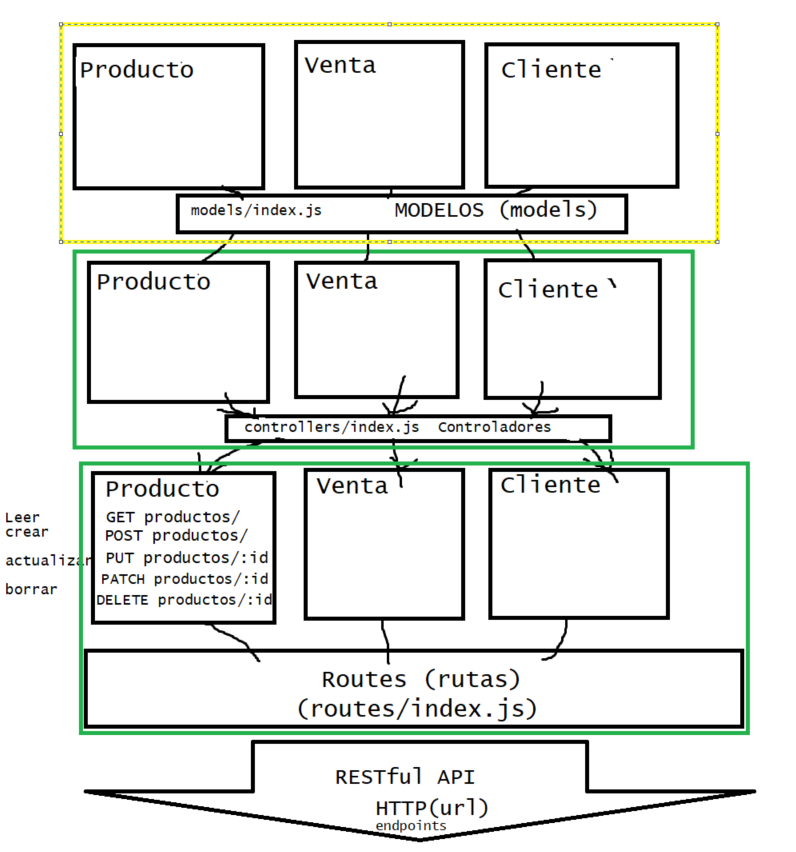
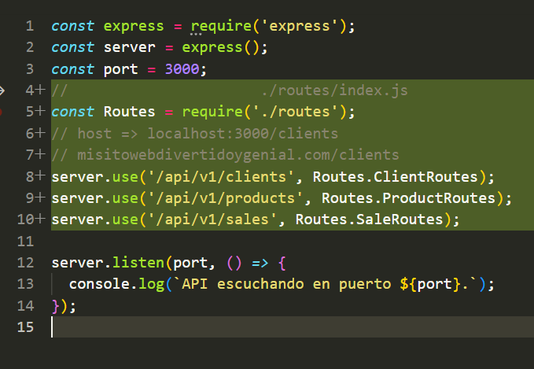

#  Backend

1. Crear la carpeta.

2. Entrar a la carpeta. ``cd 4.4.1/backend``.

3. Inicializar el proyecto `npm init -y`.

4. Añadir el ``.gitignore`` con la linea 
    ```
    node_modules/
    ```
5. Crear nuestro servidor:
    1. Instalar `express`  => `npm i express`;
    2. Crear el código base para una API con express:
    ```
        const express = require('express');
        const server = express();
        const port = 3000;

        server.listen(port, () => {
        console.log(`API escuchando en puerto ${port}.`);
        });
    ```
    
    3. Probar que nuestra API esté lista, levantando el servidor, escribiendo en la terminal:
        - `node server.js` || `nodemon server.js`
        1. Si requieres no instalar nodemon podemos agregarlo a un script.
            - Requieres agregarlo a un script en el package.json:
            - Vamos al package.json y agregamos el script `dev`
            - Agregamos un script:
                ```
                "scripts": {
                    "test": "echo \"Error: no test specified\" && exit 1",
                    "start": "node server.js"
                }
                ```
                ```
                "scripts": {
                    "test": "echo \"Error: no test specified\" && exit 1",
                    "start": "node server.js",
                    "dev": "nodemon server.js"
                },
                ```
            - Y para ejecutarlo en la terminal correremos:
                - `npm run nombreDelScript` => `npm run dev`.
            - Si no te reconoce `nodemon`, instalalo con `npm i -D nodemon`.
    4. Lo que sigue es crear el arbol de carpetas para mi arquitectura.
    

    5. Es empezar llenando loas archivos de rutas con la estrucutra básica.

        ```
        const express = require('express');
        const router = express.Router();

        router.get('/', () => {});

        module.exports = router;
        ```
    6. Importamos en el index.js de la carpeta `routes` a todos.

    ```
        const ClientRoutes = require('./ClientRoutes');
        const ProductRoutes = require('./ProductRoutes');
        const SaleRoutes = require('./SaleRoutes');

        module.exports = {
            ClientRoutes,
            ProductRoutes,
            SaleRoutes,
        };
    ```

    7. Importemoslos a la App.
    

    8. Agregamos la configuracion individual de cada controlador y lo haremos por cada entidad
        * Revisar el ejemplo con `routes/ClientRoutes`, `controllers/ClientController` y `models/Client`.

    9. Crear nuestra primer migración

        1. Asegurarse de tener instalado `knex` y `pg`

        ```json
        "dependencies": {
            "express": "^4.18.2",
            "knex": "^2.5.1",
            "pg": "^8.11.3"
        },
        ```

        2. Crear la base de datos `sales` (o el nombre de su base datos) en postgres o  asegurarse que ya existe pero sin ninguna tabla.
        
        3. Crear la carpeta `migrations` y agregar el script `knex_migrate_clients`:
            ```json
            "scripts": {
                "test": "echo \"Error: no test specified\" && exit 1",
                "start": "node server.js",
                "dev": "nodemon server.js",
                "knex_migrate_clients":"knex migrate:make clients"
            },
            ```
            * Otra forma para crear una migración sin agregar un nuevo script es utilizar `npx`
                - `npx knex migrate:make products`

        4. En la carpeta migrations se creará un archivo con la fecha y el nombre de la migración, parecido a lo siguiente: `20230816_clients.js`

        5. Dentro de ese archivo habra dos métodos: `up` y `down`.
            - En método `up` se crea la tabla `clients`
        
            ```js
            exports.up = function(knex) {
            return knex.schema.createTable('clients',   (table) => {
            table.increments('id').primary();
            table.string('first_name').notNullable();
            table.string('last_name').notNullable();
            table.boolean('active').notNullable();
            table.timestamp('created_at').defaultTo(knex.fn.now());
            })
            };
            ```

        6. Agregar el script `knex_latest`

            ```json
            "scripts": {
                "test": "echo \"Error: no test specified\" && exit 1",
                "start": "node server.js",
                "dev": "nodemon server.js",
                "knex_migrate_clients":"knex migrate:make clients",
                "knex_latest":"knex migrate:latest"
            },
            ```

        7. Comprobar en pgadmin que la tabla `clients` existe con al siguente consulta en la base de datos `sales`

            ```sql
            select * from clients
            ```

    10. Abrir insomnia para crear una Request Collection donde probaremos la API.

        * Agregar un petición HTTP de tipo POST para insertar nuestro primer cliente.
        * Agregar la dirección `http://localhost:3000/api/v1/clients`
        * Agregar un body de tipo json con un nuevo cliente:
            ```json
            {
	            "first_name":"Steven",
                "last_name":"Attara",
	            "active":true
            }
            ```
        * En caso de que recibas como respuesta un error 505 con un mensaje que empiece por `TypeError: Cannot destructure property...`, agrega la siguiente linea en el archivo server.js: 
            - `server.use(express.json());`


        
